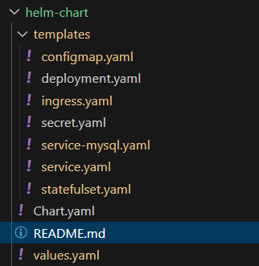

# Helm Chart for Hello-SQL Application

This Helm chart deploys the `hello-sql` application along with a MySQL database in an **Azure Kubernetes Service (AKS) cluster**.

## 🚀 Features
- **Deployment** for the application  
- **StatefulSet** for MySQL with Azure Disk persistent storage  
- **ConfigMap** for MySQL connection details  
- **Secret** for storing MySQL password  
- **Service** to expose the application and database  
- **Ingress** using Traefik  

## 📂 Chart Structure

## Step 1:-
- kubectl create ns hwsql
- helm install hello-world-release ./helm-chart -n hwsql
- helm list

## Step 2:-
- kubectl get pods -n hwsql
- kubectl get svc -n hwsql

## Step 3:-
- helm upgrade --install hello-world-release ./helm-chart/ -n hwsql (when there is new changes in deployment)

## Step 4:-
- helm uninstall hello-world-release -n hwsql